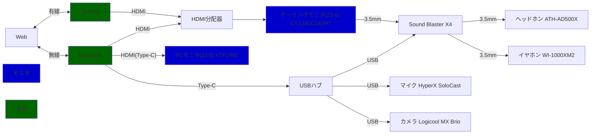

# デスク回りの設定

## 環境

```mermaid
flowchart LR
    Web <-->|無線| MacBook
    MacBook -->|Type-C| USBハブ
    USBハブ -->|USB| DAC["Sound Blaster X4"]
    USBハブ -->|USB| マイク["マイク HyperX SoloCast"]
    USBハブ -->|USB| カメラ["カメラ Logicool MX Brio"]
    MacBook -->|HDMI| HDMI分配器
    HDMI分配器 -->ゲーミングモニタ["ゲーミングモニタ(23.6) EX-LDGC242HT"]
    MacBook -->|"HDMI(Type-C)"| PCモニタ["PCモニタ(23.8) VTF2401"]

    ゲーミングモニタ -->|3.5mm| DAC
    DAC -->|3.5mm| ヘッドホン["ヘッドホン ATH-AD500X"]
    DAC -->|3.5mm| イヤフォン["イヤホン WI-1000XM2"]
    
    Web <-->|有線| Switch2
    Switch2 -->|HDMI| HDMI分配器

    style モニタ fill:#00c
    style ゲーミングモニタ fill:#00c
    style PCモニタ fill:#00c

    style 端末 fill:#060
    style MacBook fill:#060
    style Switch2 fill:#060
```
