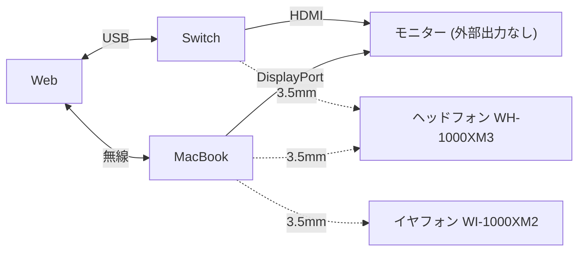
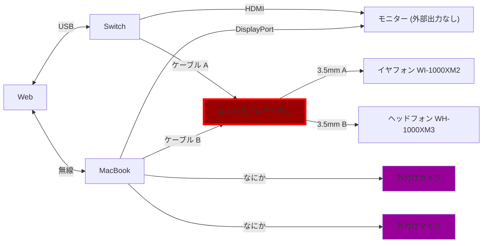

# デスク回りの設定
## current

---

## 理想

---

## 変更したいポイント
* 音回り
  * 3.5mmのつなぎ直しを減らしたい
  * switch本体に3.5mm刺すのをやめたい
* カメラ回り
  * 内蔵カメラから外付けカメラにしたい
  * 外付けカメラにしたらマイクもほしい
  * 照明を電球からLEDに変更したい

## 現状ポイント
* MacBookのUSBポートは、電源、キーボード
* SwitchドックのUSBポートが有線LANで埋まってる
* モニタからHDMIとかスピーカーは出力できない
* デスク上の余剰スペースは15*25cmくらい
