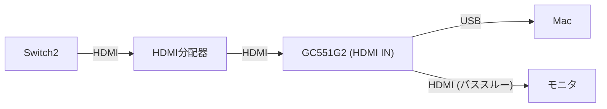

# GC551G2 と OBS Studio で Switch2 の画面を Mac で録画する手順

## 前提条件

- GC551G2 が USB で Mac に接続済み
- OBS Studio がインストール済み
- Switch2 の HDMI 出力が利用可能

## ハードウェアの接続

[desktop.md](./desktop.md) の After 構成に合わせて、以下の順で接続する。

### 手順

1. Switch2 の HDMI 出力を HDMI 分配器の入力に接続する
2. HDMI 分配器の出力の 1 つを GC551G2 の **HDMI IN** ポートに接続する
3. GC551G2 の **HDMI OUT** ポートをモニタに接続する（ゲームをプレイしながら録画するため）
4. GC551G2 を USB ケーブルで Mac（または USB ハブ）に接続する

> **注意:** GC551G2 の **HDMI IN** に Switch2 の映像を入力しないと、OBS に映像が表示されない。

## OBS Studio の設定

### ビデオキャプチャデバイスの追加

1. OBS Studio を起動する
2. **ソース** パネルの `+` ボタンをクリックする
3. **映像キャプチャデバイス** を選択する
4. 名前を入力（例: `Switch2`）して **OK** をクリックする
5. **デバイス** のドロップダウンから `GC551G2` を選択する
   - このタイミングで macOS のカメラアクセス許可ダイアログが表示された場合は **OK** をクリックして許可する
6. 以下の設定を行う：
   - **解像度**: `1920x1080`
   - **フレームレート**: `60` fps
7. **OK** をクリックする

> **ポイント:** GC551G2 が正しく接続されていれば、デバイス一覧に `GC551G2` または `USB Capture HDMI 4K+` と表示される。

### 音声の設定

GC551G2 からの音声も OBS に取り込む場合は以下の設定を行う。

1. **ソース** パネルの `+` ボタンをクリックする
2. **音声キャプチャデバイス** を選択する
3. 名前を入力（例: `Switch2 音声`）して **OK** をクリックする
4. **デバイス** のドロップダウンから `GC551G2` を選択する
5. **OK** をクリックする

または、**設定** → **音声** にある **補助音声** に `GC551G2` を設定する方法もある。

## macOS のカメラ権限を後から確認する場合

デバイス選択時に許可ダイアログが表示されなかった場合や、映像が映らない場合は以下を確認する。

1. **システム設定** を開く
2. **プライバシーとセキュリティ** → **カメラ** を選択する
3. **OBS** のトグルがオンになっていることを確認する

## 録画・配信の開始

1. OBS の **プレビュー** に Switch2 の映像が表示されていることを確認する
2. **録画開始** または **配信開始** をクリックする

## トラブルシューティング

| 症状 | 確認事項 |
| --- | --- |
| OBS のソース一覧に GC551G2 が表示されない | USB ケーブルの再接続、macOS のカメラ権限の確認 |
| 映像が黒い・映らない | Switch2 → HDMI分配器 → GC551G2 (HDMI IN) の接続を確認 |
| 音声が出ない | OBS の音声キャプチャデバイスに GC551G2 が設定されているか確認 |
| 映像がカクつく | USB ハブの帯域幅を確認。USB 3.0 対応のハブを使用する |
| macOS がデバイスを認識しない | Mac を再起動し、USB ケーブルを直接 Mac に接続して試す |
