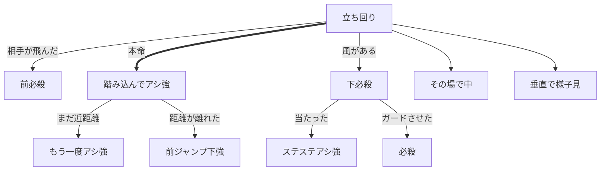
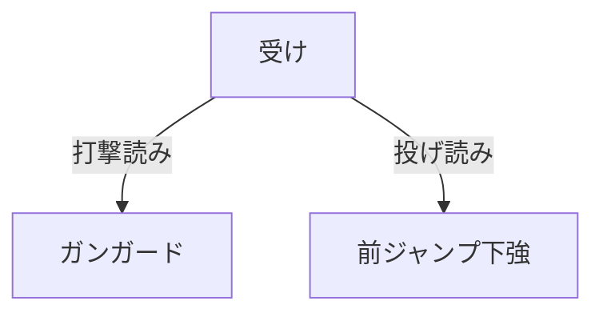

# リリー

## やること

### 立ち回り

1. 立ち回り
    1. 【本命】踏み込んでアシ強
        1. [if]アシ強後の距離が近いなら → もう一度アシ強
        1. [if]アシ強後の距離が離れてるなら → ジャンプ下強
    1. [if]風があるなら → 下必殺
        1. [if]下必殺当たったら → ステステアシ強重ね
        1. [if]下必殺ガードされたら → 必殺
    1. その場で中
    1. 垂直で様子見
1. [if]相手が飛んだら → 前必殺

### 受け

1. [if]打撃読んだら → ガンガード
1. [if]投げ読んだら → 前ジャンプ下強

### フローチャート

