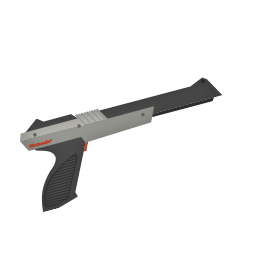
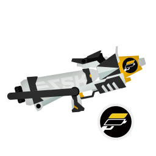
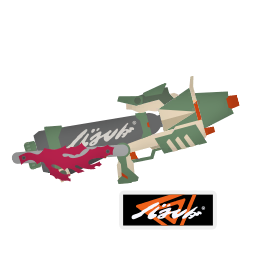
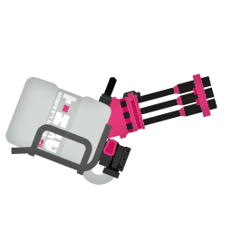
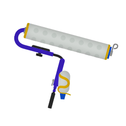
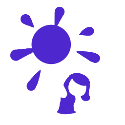
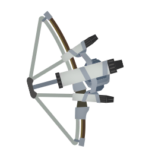
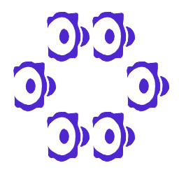

# スプラ3

## Private ブキTier

|区分|ナワバリ|エリア|ヤグラ|ホコ|アサリ|
|-|-|-|-|-|-|
|短射程||||||
|中射程|-|||||
|長射程||||||

## 持ちブキ

|名前|射程|ダメージ|必要P|サブ|スペ|重量|ナワバリ|エリア|ヤグラ|ホコ|アサリ|♡|
|-|-|-|-|-|-|-|-|-|-|-|-|-|
||2.5|30|200|||中|○|○|○|○|○|★★|
||横(一確) 1.5 横(ダメ) 2.4 縦(一確) 1.7 縦(ダメ) 3.2|40〜150|180|||中|✗|○|○|○|○|★★★|
||3.4|42|210|||中|△|○|○|△|△|★|
||3.4|42|180|||中|○|○|○|○|○|★★|
||4.1|30|200|||中|○|◎|◎|◎|◎|★★★★★|
||2.7 3.0 5.2|30 35+30 35+30|190|||中|△|△|○|△|△|★|

- ♡ = 幸福度 = 練度 ✕ 感じてる可能性 ✕ モチベ

## ギア

- [ギアまとめ](https://x.com/kotaoue/status/1979514125622620457)

## Links

- [全般メモ](./memo.md)
- [バレル](./HeavySplatling.md)
- [Splatoon3 - スプラトゥーン3 攻略＆検証 Wiki*](https://wikiwiki.jp/splatoon3mix/)
- [INKIPEDIA](https://splatoonwiki.org/wiki/Main_Page)
- [sendou.ink](https://sendou.ink/)
- [スプラトゥーン3　ステージ図面](https://note.com/sunfish3/n/nc029f8edb031)
