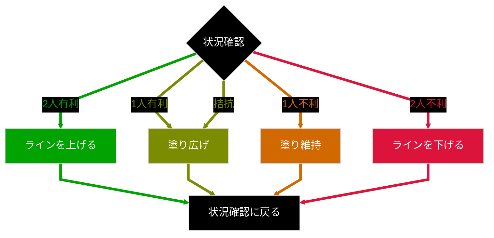
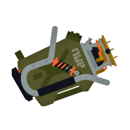

# バレル

&nbsp;&nbsp;

## 立ち回り

- バレルは「事前準備」のブキ。
- バレルは「壁裏チャージ」と「歩き撃ち」の繰り返しで「遮蔽」から「遮蔽」に進むブキ

### キホンのif-then

| 状況 | if-then | 補足 |
| -- | -- | -- |
| プレイ | <ol><li>[if]チャージ前 → 一呼吸</li><li>壁裏チャージ</li><li>[if]チャージ後 → 一呼吸</li><li>歩き撃ち</li></ol> | Wall->Stay->Walk"> |
| 思考 | <ul><li>[if]観察したら → 口に出す</li><li>[if]状況判断したら → 口に出す</li><li>[if]意思決定したら → 口に出す</li><li>[if]実行するとき → 口に出す</li></ul> | |

### 試合中のif-then

| 状況 | if-then | 補足 |
| -- | -- | -- |
| OODA | <ul><li>[if]Observe: 観察したら → 口に出す</li><li>[if]Orient: 状況判断したら → 口に出す</li><li>[if]Decide: 意思決定したら → 口に出す</li><li>[if]Act: 実行するとき → 口に出す</li></ul> | <ol><li>Observe: 右からテキ詰めてきてる</li><li>Orient: 52だな。チャージできてる</li><li>Decide: 引き撃ちするか</li><li>Act: 引き撃ち！</li></ol> |
| 索敵 | <ul><li>[if]対面していない時は → 注意するポイントを順番に見る</ul> | <ol><li>見るべき場所を先に決めておく</li><li>危ない順に目視確認をする</li><li>確認終わったら、再度最初から確認</li></ol> |
| 視線 | <ul><li>[if]自キャラを見てるなら → 視線を上げる</li><li>[if]射撃を開始するなら → レティクルを見る</li><li>[if]射撃してるなら → レティクル以外を見る</li><li>[if]画面上部に視線移動して索敵したなら → ついでにイカランプ見る</li></ul> | |
| 上げ判断 | <ul><li>[if]ミカタ2人以上が前にいるなら → 索敵する</li><li>[if]人数有利だったら → ラインを上げる</li></ul> | |
| 下げ判断 | <ul><li>[if]テキインクまで2本以内なら → 下がる</li><li>[if]画面にミカタの名前が無いなら → 下がる</li></ul> | |
| ライン上げ下げ | <ul><li>[if]ライン上げるなら → 次の遮蔽まで</li><li>[if]ライン下げるなら → 一つ前の遮蔽まで</li></ul> | |
| カバー | <ul><li>[if]チャージがあれば → 積極的にカバーする</li><li>[if]チャージがなければ → 無理をしない</li></ul> | |

### 試合後のif-then

| 状況 | if-then |
| -- | -- |
| ふりかえり | <ul><li>[if]負けたら → 勝ち筋振り返る</li><li>[if]勝ったら → どのプレイが勝ちにつながったか振り返る</li></ul> |
| メモプ | <ul><li>[if]連敗したら → メモプ見る</li><li>[if]k/d割ったら → メモプ見る</li><li>[if]勝ち筋わからなかったら → メモプ見る</li></ul> |

### 突き詰めた立ち回り

### その他、立ち回りのポイント

#### トリコレ

1. 試合とは 「思考」しながら「プレイ」を繰り返すこと
1. 試合を「プレイ」の繰り返しにするのは「思考」を繰り返すため

#### +α

- Ver 11.0.0 で明確に塗りブキになった。生存しているだけでアド！！
- 「一貫性」を持った行動が大事。アドリブはNG。思考して行動する
- 少しずつアドバンテージを増やす
- 相手の土俵で戦わずこちらの有利を押し付ける
- 試合が終わった後のふりかえりも「一貫性」が大事。同じ基準で比較していく
- なんとなくで試合するのはNG。試合に目的持つのが大事

Before Ver.11.0.0

1. 全般において事前準備が大切。チャージが必要でワンテンポ遅れるので突発的に対応するよりも事前に準備をして対応するというのが、すべてのキホン
1. 塗りが強いから塗り合いをしてたら有利は広がる、逆にワンチャン狙ってゴリ押しできるブキではないので、無理をせずにゆっくりとアドバンテージを広げる意識が大事
1. 全部をそつなくこなすことのできる武器ではあるが、特化した強みも無いので、自分の得意を押し付けるのではなくて相手よりも得意なことをやる

- 全体
  - なんでもできるからなんでもしないとダメ
  - 相手より有利なところを押し付ける
    - 有利なところとはバレルとしての絶対的な強みではなく、相手と比較した時の相対的な強み
- 立ち位置
  - 射程のギリギリを押し付ける
    - 撃ちながら前に進むのが強い。バレルの弾の先で突くイメージ
    - クリアリングも射程の先で行う ※耳かきみたいなイメージ
  - 前線を上げるんじゃなくて、前線に引っ張られる状況もある
  - 長射程がいたら高台に立たない
- 戦術
  - 敵が来たそうな場所に置き撃ちしておく
  - 「テキが通りたいルートを塗っておく」「ミカタが通りたいルートを塗っておく」
  - 射程とダメージ変わらないので一周チャージを有効に使う
    - フルチャばっかりだと前線に遅れるし、インクもなくなりがち
  - 短射程相手はブロック近くで戦わず、広い場所で射程を押し付ける
  - チャージ中に周りを見る
  - チャージャーは倒すんじゃなくて倒されないのスタンス
  - チャージ中は遅いので、チャージしながら歩くよりもイカで移動してからチャージしたほうが早い
    - 移動して壁裏チャージ
  - 塗りはまん中が抜ける
    - 最高効率は上下に振ることだが実戦だと難しいので円を描くように回す
    - 塗りブキと正面から塗り合っても勝てないので塗りブキは先端で撃って追い払うことを重視

## 気をつけるブキ

| ポイント | 詳細 | ブキ |
| ---- | -- | -- |
| バレル以上の射程 | > 0.5 | ()() |
| - | >= 1.0 | () |
| - | >= 1.5 | () |
| - | >= 2.0 |  |
| バレル以上のキル速 | !1確 | ()()() |
| バレル以上の射程&キル速 | - |  |

## links

- 記事
  - [勝ち負けトントンから始めるスプラトゥーン攻略メモ with バレルスピナー](https://note.com/kotaoue/n/nb3e3413c759a)
  - [スプラ3wiki:バレルスピナー](https://wikiwiki.jp/splatoon3mix/%E3%83%96%E3%82%AD/%E3%83%90%E3%83%AC%E3%83%AB%E3%82%B9%E3%83%94%E3%83%8A%E3%83%BC)
  - [より賢くプレイする：戦術的思考を改善するためのガイド](https://note.com/hara_di/n/nb82d45cd30e7)
  - [OODAループ](https://ja.wikipedia.org/wiki/OODA%E3%83%AB%E3%83%BC%E3%83%97)
  - [射撃と運動](https://ja.wikipedia.org/wiki/%E5%B0%84%E6%92%83%E3%81%A8%E9%81%8B%E5%8B%95)
- 動画
  - [再生リスト:バレル](https://youtube.com/playlist?list=PLp_4KCODScDE_rMZY5TIUXE3yNhVBxk1W&si=NPFi70v2GzXO4yQ3)
  - [【ブキ解説】金バッジ常連マルチウェポナーがバレルスピナーの全部を教えます【るす】](https://www.youtube.com/watch?v=U0BYkf0Dm00)
  - [スピナーで簡単にキルが取れる方法解説【バレルスピナー】](https://www.youtube.com/watch?v=kH2dufXwR0o)
  - [【スピナー】誰でも上級者の動きになるキャラコン解説【スプラ３】](https://www.youtube.com/watch?v=-rm13bAuax8)
  - [有効キルは立ち位置で決まる【オーバーフロッシャー】](https://www.youtube.com/watch?v=cbxmMGWsROc) ※ バレルの考え方とも一致
  - [難所で崩れないハイドラの立ち回り。私の”安定ルーティン”公開【スプラトゥーン３】](https://www.youtube.com/watch?v=2iWkbRPVMPQ) ※ 下がり方が参考になる
- ステージ
  - [スプラ気をつけるポイント:バレル:ステージ](https://docs.google.com/spreadsheets/d/1JlSD02TxEMjEiwJZ0Kd5NAbjlgZKQplCbdxq-N9SC8s/edit?gid=1579070159#gid=1579070159)
  - [この動画を見るだけでヒラメが丘団地バレルスピナーの立ち回りが分かります【スプラトゥーン3】](https://www.youtube.com/watch?v=sSO1gZKmWus)
- その他
  - [3D Model Heavy Splatling](https://sketchfab.com/3d-models/heavy-splatling-e7317dddfa594fbebd75dc3593455533)
