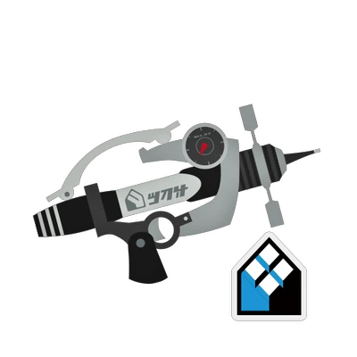
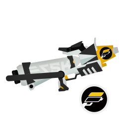
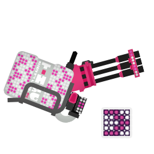

## Private ブキTier
|役割|ナワバリ|エリア|ヤグラ|ホコ|アサリ|
|-|-|-|-|-|-|
|前衛||||||
|中衛|-|||||
|後衛||||||

## 持ちブキ
|名前|射程|ダメージ|必要P|サブ|スペ|重量|ナワバリ|エリア|ヤグラ|ホコ|アサリ|♡|
|-|-|-|-|-|-|-|-|-|-|-|-|-|
||2.2|28|180|||軽|○|○|○|○|○|★|
||2.4|28|200|||軽|○|◎|◎|○|○|★|
||2.5|36|190|||中|○|○|○|○|○|★★|
||3.4|42|210|||中|○|○|○|○|○|★|
||4.1|30|200|||中|○|◎|◎|◎|◎|★★★|
||4.1|30|200|||中|○|◎|◎|◎|◎|★★★|
||4.5|30\*4|190|||中|△|△|△|△|△|★★|
||2.7 3.0 5.2|30 35+30 35+30|190|||中|△|△|◎|○|○|★★★★|

- ♡ = 幸福度 = 練度 * 感じてる可能性 * モチベ
## コーデ
### アタマ
|アイテム|1|0.3|0.3|0.3|
|-|-|-|-|-|
|ショートビーニー|||||
|ミミタコ8 RAW|||||
|ボーラークラシック|||||
|マルサンSV925|||||
|ヤキフグ サンバイザー|||||
|ヤコメッシュ|||||
|タレサン18K|||||
|バイカーシェード|||||
|オクタグラス|||||
|エラブリーズマスク|||||
|ウールウーニーズクラシック|||||
### フク
|アイテム|1|0.3|0.3|0.3|
|-|-|-|-|-|
|イカノメT ブラック|||||
|ガチガサネ|||||
|F-190|||||
|クラーゲス528|||||
|マウンテンオリーブ|||||
|タコピステブルー|||||
|アイロニックレイヤード|||||
|イカライダーBLACK|||||
|バハフーディー セレステ|||||
|タコT|||||
|バンドカラー ムジ|||||
|コテボレロ ネガ|||||
|トワイライトグラデT|||||
|ケンサキコーチ|||||
### クツ
|アイテム|1|0.3|0.3|0.3|
|-|-|-|-|-|
|オレンジアローズ|||||
|ザ・ベース・ルーキー|||||
|ザ・ベース・ボス|||||
|エゾックロッグ レッド|||||
|キャンバスHi モロヘイヤ|||||
|ロッキンチェリー|||||
|ベリベリホワイト|||||
|エギング4 アカクロ|||||
|キャンバスHi トマト|||||
|フカヒレニマイバ サンド|||||
|BBサンダル|||||
|エギング5 シロアカ|||||
|チャッカブーツ サンド|||||
