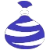
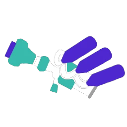
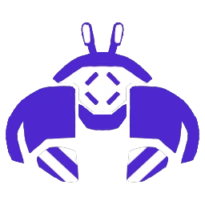
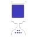
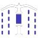
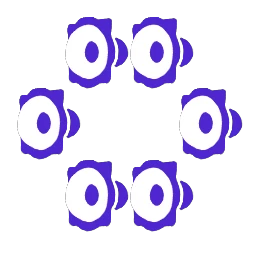
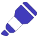
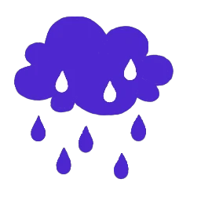

# 感度
* ジャイロ 4
* 操作 4

## ブキ
|名前|射程|ダメージ|必要P|サブ|スペ|重量|エリア|ヤグラ|ホコ|アサリ|♡|
|-|-|-|-|-|-|-|-|-|-|-|-|
|カーデコ|0.9〜1.7 1.3〜2.7|25〜100 35〜100|200|||軽|○|○|○|◎|★★|
|わかば|2.2|28|180|||軽|○|◎|○|◎|★★|
|もみじ|2.2|28|190|||軽|○|○|○|○|★★|
|シャーカー|2.4|28|200|||軽|◎|○|○|◎|★★|
|スパイ|2.4|9〜40|180|||軽|○|○|○|○|★★★|
|スシ|2.5|36|190|||中|◎|◎|◎|◎|★★★★|
|スシコラ|2.5|36|190|||中|◎|○|◎|○|★★★|
|52|2.6|52|190|||中|○|○|○|○|★★|
|デュアル|3.1 3.4|28|200|||中|△|△|△|○|★|
|スペシュ|3.2|24|190|||中|○|△|○|○|★★|
|プライム|3.4|42|180|||中|△|△|○|○|★|
|オフロ|4.5|30\*4|190|||中|◎|○|◎|△|★★★★|
|ハイドラ|4.8|32 40|190|||重|△|○|○|△|★★★|
|リッター|2.3 6.2 6.2|40 80 180|210|||重|○|◎|○|○|★★|

- ♡ = 幸福度 = 練度 * 感じてる可能性 * モチベ
## コーデ
### アタマ
|アイテム|★|メイン|サブ1|サブ2|サブ3|
|-|-|-|-|-|-|
|ミミタコ8 RAW|4|メイン効率|メイン効率|安全靴|サブ減|
|ヤコメッシュ|2|スペ性|イカ速|安全靴|サブ減|
|タレサン18K|4|ラスパ|イカ速|安全靴|サブ減|
|バイカーシェード|5|ラスパ|サブ減|スペ減|メイン効率|
|エラブリーズマスク|3|逆境|スペ増|スペ増|ジャン短|
|ウールウーニーズクラシック|5|カムバ|スペ減|安全靴|サブ減|
### フク
|アイテム|★|メイン|サブ1|サブ2|サブ3|
|-|-|-|-|-|-|
|マウンテンオリーブ|3|ヒト速|イカ速|イカ速|安全靴|
|タコピステブルー|4|イカ速|スペ増|スペ|スペ蔵|
|アイロニックレイヤード|3|イカ速|イカ速|インク回復|サブ減|
|バハフーディー セレステ|2|イカニン|イカ速|イカ速|イカ速|
|コテボレロ ネガ|5|サーマル|インク回復|メイン効率|スペ性|
|トワイライトグラデT|4|サーマル|復短|復短|メイン効率|
|ケンサキコーチ|3|ペナアップ|イカ速|スペ増|ジャン短|
### クツ
|アイテム|★|メイン|サブ1|サブ2|サブ3|
|-|-|-|-|-|-|
|オレンジアローズ|3|メイン効率|サブ減|サブ減|安全靴|
|ザ・ベース・ルーキー|5|メイン効率|インク回復|ジャン短|安全靴|
|ザ・ベース・ボス|5|サブ効率|スペ減|ジャン短|安全靴|
|ベリベリホワイト|4|スペ性|スペ増|ジャン短|安全靴|
|エギング4 アカクロ|2|スペ増|ジャン短|安全靴|サブ減|
|フカヒレニマイバ サンド|5|対物|ジャン短|安全靴|メイン効率|
|チャッカブーツ サンド|5|ステジャン|スペ減|ジャン短|安全靴|
## 所持ギア
|ブランド|かけら|頭|体|足|
|-|-|-|-|-|
|バトロイカ|相手インク影響軽減|★★|★★|★|
|アイロニック|スーパージャンプ時間短縮|★★|★★★★|★★|
|クラーゲス|イカダッシュ速度アップ|★★★★★|★★|★★|
|ロッケンベルグ|ヒト移動速度アップ|★★|★★|★★|
|エゾッコ|スペシャル減少量ダウン|★★|★★|★★|
|フォーリマ|スペシャル性能アップ|★★★|★★|未発売|
|ホッコリー|インク効率アップ(サブ)|★★|★★|★★|
|ホタックス|復活時間短縮|★★|★★★★|-|
|ジモン|インク効率アップ(メイン)|★★|★★|★★★★|
|シグレニ|サブ影響軽減|★★|★★★|★★|
|アロメ|インク回復力アップ|★★|★★|★★|
|ヤコ|スペシャル増加量アップ|★★|★★★★|★★|
|アナアキ|インク効率アップ(サブ)|★★|★★|★★|
|エンペリー|サブ性能アップ|★★|★★|★★|
|タタキケンサキ|インク効率アップ(メイン)|★★|★★★★★|★★★|
|バラズシ|アクション強化|★★★★★|★★|★★★★★|
|シチリン|アクション強化|★★|★★|★★★★★|