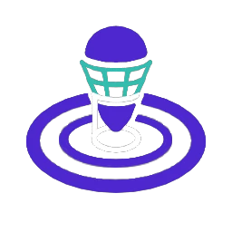
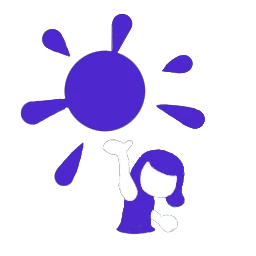
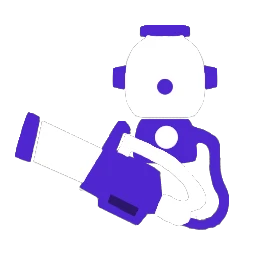

# 感度
* ジャイロ 4
* 操作 4

## ブキ
|名前|射程|ダメージ|必要P|サブ|スペ|重量|エリア|ヤグラ|ホコ|アサリ|♡|
|-|-|-|-|-|-|-|-|-|-|-|-|
|もみじ|2.3|28|180|||軽|○|○|○|○|★★★★|
|シャーカー|2.4|28|200|||軽|◎|○|○|◎|★★★★|
|スシ|2.6|36|200|||中|○|◎|○|○|★|
|52|2.8|52|200|||中|△|○|○|○|★|
|プライム|3.5|42|190|||中|△|△|○|○|★★|
|プラコラ|3.5|42|210|||中|△|◎|○|○|★|
|デュアル|3.5|28|200|||中|△|△|△|○|★★|
|ジェット|4.6|32|190|||中|△|○|△|△|★★★|
|弓|2.7 3.0 5.2|30\*3 35\*3 爆風28 35\*3 爆風28|200|||中|△|△|△|△|★★★|
|スプチャ|2.3 5.2 5.2|40 80 160|200|||中|○|○|○|○|★★|
|オフロ|5.5|30\*4|190|||中|◎|○|◎|△|★★★★|

- ♡ = 幸福度 = 練度 * 感じてる可能性 * モチベ
## コーデ
### アタマ
|アイテム|メイン|サブ1|サブ2|サブ3|
|-|-|-|-|-|
|★★ ヤコメッシュ|スペシャル性能アップ|イカダッシュ速度アップ|相手インク影響軽減|サブ影響軽減|
|★★★★ バイカーシェード|ラストスパート|サブ影響軽減|スペシャル減少ダウン|インク効率アップ(メイン)|
|★★★★ ウールウーニーズクラシック|カムバック|スペシャル減少ダウン|相手インク影響軽減|サブ影響軽減|
### フク
|アイテム|メイン|サブ1|サブ2|サブ3|
|-|-|-|-|-|
|★★★★ タコピステブルー|イカダッシュ速度アップ|スペシャル増加量アップ|スペシャル増加量アップ|スペシャル増加量アップ|
|★★★ アイロニックレイヤード|イカダッシュ速度アップ|イカダッシュ速度アップ|インク回復力アップ|スペシャル増加量アップ|
|★★ バハフーディー セレステ|イカニンジャ|イカダッシュ速度アップ|イカダッシュ速度アップ|イカダッシュ速度アップ|
|★★★★★ コテボレロ ネガ|サーマルインク|インク回復力アップ|インク効率アップ(メイン)|スペシャル性能アップ|
|★★★★ トワイライトグラデT|サーマルインク|復活時間短縮|復活時間短縮|インク効率アップ(メイン)|
|★★★ ケンサキコーチ|復活ペナルティアップ|イカダッシュ速度アップ|スペシャル増加量アップ|スーパージャンプ短縮|
### クツ
|アイテム|メイン|サブ1|サブ2|サブ3|
|-|-|-|-|-|
|★★★★★ ザ・ベース・ルーキー|インク効率アップ(メイン)|インク回復力アップ|スーパージャンプ短縮|相手インク影響軽減|
|★★★★ ザ・ベース・ボス|インク効率アップ(サブ)|スペシャル減少ダウン|スーパージャンプ短縮|相手インク影響軽減|
|★★★★ ベリベリホワイト|スペシャル性能アップ|スペシャル増加量アップ|スーパージャンプ短縮|相手インク影響軽減|
|★★★★★ フカヒレニマイバ サンド|対物攻撃力アップ|スーパージャンプ短縮|相手インク影響軽減|インク効率アップ(メイン)|
|★★★★★ チャッカブーツ サンド|ステルスジャンプ|スペシャル減少ダウン|スーパージャンプ短縮|相手インク影響軽減|
## 所持ギア
|かけら|ブランド|頭|体|足|
|-|-|-|-|-|
|インク効率アップ(メイン)|ジモン or タタキケンサキ|★★|★★★★★|★★★★|
|インク効率アップ(サブ)|ホッコリー or アナアキ|★★|★★|★★|
|インク回復力アップ|アロメ|★★|★★|★★|
|ヒト移動速度アップ|ロッケンベルグ|★★|★★|★★|
|イカダッシュ速度アップ|クラーゲス|★★★★|★★|★★|
|スペシャル増加量アップ|ヤコ|★★|★★★★|★★|
|スペシャル減少量ダウン|エゾッコ|★★|★★|★★|
|スペシャル性能アップ|フォーリマ|★★|★★|未発売|
|復活時間短縮|ホタックス|★★|★★★★|-|
|スーパージャンプ時間短縮|アイロニック|★★|★★★|★★|
|サブ性能アップ|エンペリー|★★|★★|★★|
|相手インク影響軽減|バトロイカ|★★|★★|未発売|
|サブ影響軽減|シグレニ|★★|★★|★★|
|アクション強化|バラズシ or シチリン|★★★★|★★|★★★★★|