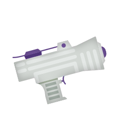
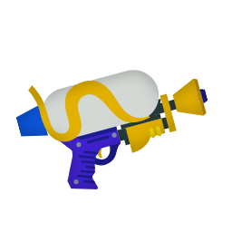
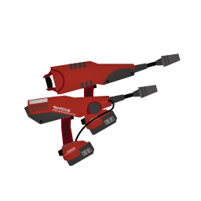
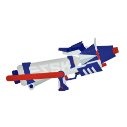
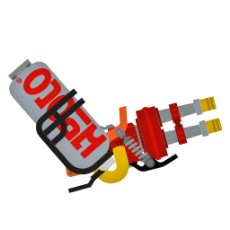
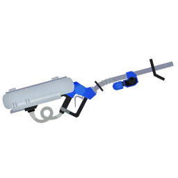

# 感度
* ジャイロ 4
* 操作 4

## ブキ
|名前|射程|ダメージ|必要P|サブ|スペ|重量|エリア|ヤグラ|ホコ|アサリ|♡|
|-|-|-|-|-|-|-|-|-|-|-|-|
||0.9〜1.7 1.3〜2.7|25〜100 35〜100|200|||軽|○|○|○|◎|★|
||2.1 2.7|125 50〜70|180|||中|○|◎|○|○|★|
||2.2|28|180|||軽|○|◎|○|◎|★★|
||2.2|28|190|||軽|○|○|○|○|★|
||2.4|28|200|||軽|◎|○|○|◎|★|
||2.4|9〜40|180|||軽|○|○|○|○|★★|
||2.5|36|190|||中|◎|◎|◎|◎|★★|
||2.5|36|190|||中|◎|○|◎|○|★★★|
||2.6|52|190|||中|○|○|○|○|★★|
||3.1 3.4|28|200|||中|△|△|△|○|★|
||3.2|24|190|||中|○|△|○|○|★|
||3.4|42|180|||中|△|△|○|○|★|
||4.1|15 30|200|||中|○|◎|◎|○|★★★|
||4.5|30\*4|190|||中|◎|○|◎|△|★★★|
||4.8|32 40|190|||重|△|○|○|△|★★|
||2.3 6.2 6.2|40 80 180|210|||重|○|◎|○|○|★|

- ♡ = 幸福度 = 練度 * 感じてる可能性 * モチベ
## コーデ
### アタマ
|アイテム|★|メイン|サブ1|サブ2|サブ3|
|-|-|-|-|-|-|
|ミミタコ8 RAW|4|||||
|マルサンSV925|2|||||
|ヤコメッシュ|2|||||
|タレサン18K|4|||||
|バイカーシェード|5|||||
|エラブリーズマスク|3|||||
|ウールウーニーズクラシック|5|||||
### フク
|アイテム|★|メイン|サブ1|サブ2|サブ3|
|-|-|-|-|-|-|
|マウンテンオリーブ|5|||||
|タコピステブルー|4|||||
|アイロニックレイヤード|3|||||
|イカライダーBLACK|2|||||
|バハフーディー セレステ|2|||||
|コテボレロ ネガ|5|||||
|トワイライトグラデT|4|||||
|ケンサキコーチ|3|||||
### クツ
|アイテム|★|メイン|サブ1|サブ2|サブ3|
|-|-|-|-|-|-|
|オレンジアローズ|3|||||
|ザ・ベース・ルーキー|5|||||
|ザ・ベース・ボス|5|||||
|ベリベリホワイト|4|||||
|エギング4 アカクロ|2|||||
|フカヒレニマイバ サンド|5|||||
|チャッカブーツ サンド|5|||||
## 所持ギア
|ブランド|かけら|頭|体|足|
|-|-|-|-|-|
|バトロイカ|相手インク影響軽減|★★|★★|★|
|アイロニック|スーパージャンプ時間短縮|★★|★★★★|★★|
|クラーゲス|イカダッシュ速度アップ|★★★★★|★★|★★|
|ロッケンベルグ|ヒト移動速度アップ|★★|★★|★★|
|エゾッコ|スペシャル減少量ダウン|★★|★★|★★|
|フォーリマ|スペシャル性能アップ|★★★|★★|未発売|
|ホッコリー|インク効率アップ(サブ)|★★|★★|★★|
|ホタックス|復活時間短縮|★★|★★★★|-|
|ジモン|インク効率アップ(メイン)|★★|★★|★★★★|
|シグレニ|サブ影響軽減|★★|★★★★★|★★|
|アロメ|インク回復力アップ|★★|★★|★★|
|ヤコ|スペシャル増加量アップ|★★|★★★★|★★|
|アナアキ|インク効率アップ(サブ)|★★|★★|★★|
|エンペリー|サブ性能アップ|★★|★★|★★|
|タタキケンサキ|インク効率アップ(メイン)|★★|★★★★★|★★★|
|バラズシ|アクション強化|★★★★★|★★|★★★★★|
|シチリン|アクション強化|★★|★★|★★★★★|