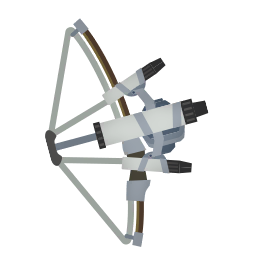
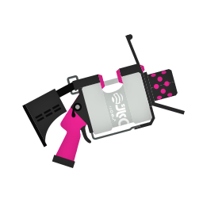

# バレル

&nbsp;&nbsp;

## 立ち回り

- バレルの真髄は「事前準備」
- ❌️ 一回のチャンスで勝つ ⭕️ 少しずつアドバンテージを増やす
- 相手の土俵で戦わずこちらの有利を押し付ける

### キホンのif-then

| 状況 | if-then |
| -- | -- |
| 原則 | <ol><li>塗る</li><li>[if]危険を感じたら → 引く</li><li>[if]ミカタがSP使ったら → 合わせる</li><li>[if]2人有利になったら → 前に出る</li></ol> |
| 確認 | <ul><li>[if]情報手に入れたら → わかったことを口に出す<ul><li>e.g. ミカタ落ちた</li><li>e.g. 壁裏ブラスターいる</li><li>e.g. SP溜まったけどミカタまだ</li></ul></li></ul> |
| 索敵 | <ul><li>[if]対面していない時は → 注意するポイントを順番に見る<ul><li>❌️ 全部を見る。※ それは無理</li><li>⭕️ 先に決めた注意すべき場所を順番に見ていく。※ 危ない順に目視確認をしていく</li></ul></ul> |
| 射撃 | <ul><li>[if]チャージする前に → 周りを見る</li><li>[if]チャージするなら → 壁裏</li><li>[if]チャージしたなら → 周りを見る</li><li>[if]撃つなら → 動き続ける</li></ul> |

### 余裕があったら考える

| 状況 | if-then |
| -- | -- |
| 上げ判断 | <ul><li>[if]ミカタ2人以上が前にいるなら → 索敵する</li><li>[if]人数有利だったら → ラインを上げる</li></ul> |
| 下げ判断 | <ul><li>[if]テキインクまで2本以内なら → 下がる</li><li>[if]画面にミカタの名前が無いなら → 下がる</li></ul> |
| ライン上げ下げ | <ul><li>[if]ライン上げるなら → 次の遮蔽まで</li><li>[if]ライン下げるなら → 一つ前の遮蔽まで</li></ul> |
| カバー | <ul><li>[if]チャージがあれば → 積極的にカバーする</li><li>[if]チャージがなければ → 無理をしない</li></ul> |
| 視線 | <ul><li>[if]自キャラを見てるなら → 視線を上げる</li><li>[if]射撃を開始するなら → レティクルを見る</li><li>[if]射撃してるなら → レティクル以外を見る</li><li>[if]画面上部に視線移動して索敵したなら → ついでにイカランプ見る</li></ul> |

### 突き詰めた立ち回り

### その他、立ち回りのポイント

- Ver 11.0.0 で明確に塗りブキになった。生存しているだけでアド！！

Before Ver.11.0.0

- 全体
  - なんでもできるからなんでもしないとダメ
  - 相手より有利なところを押し付ける
    - 有利なところとはバレルとしての絶対的な強みではなく、相手と比較した時の相対的な強み
- 立ち位置
  - 射程のギリギリを押し付ける
    - 撃ちながら前に進むのが強い。バレルの弾の先で突くイメージ
    - クリアリングも射程の先で行う ※耳かきみたいなイメージ
  - 前線を上げるんじゃなくて、前線に引っ張られる状況もある
  - 長射程がいたら高台に立たない
- 戦術
  - 敵が来たそうな場所に置き撃ちしておく
  - 「テキが通りたいルートを塗っておく」「ミカタが通りたいルートを塗っておく」
  - 射程とダメージ変わらないので一周チャージを有効に使う
    - フルチャばっかりだと前線に遅れるし、インクもなくなりがち
  - 短射程相手はブロック近くで戦わず、広い場所で射程を押し付ける
  - チャージ中に周りを見る
  - チャージャーは倒すんじゃなくて倒されないのスタンス
  - チャージ中は遅いので、チャージしながら歩くよりもイカで移動してからチャージしたほうが早い
    - 移動して壁裏チャージ
  - 塗りはまん中が抜ける
    - 最高効率は上下に振ることだが実戦だと難しいので円を描くように回す
    - 塗りブキと正面から塗り合っても勝てないので塗りブキは先端で撃って追い払うことを重視

## 気をつけるブキ

| ポイント | 詳細 | ブキ |
| ---- | -- | -- |
| バレル以上の射程 | > 0.5 | ()() |
| - | >= 1.0 | () |
| - | >= 1.5 | () |
| - | >= 2.0 |  |
| バレル以上のキル速 | !1確 | ()()() |
| バレル以上の射程&キル速 | - |  |

## links

- [勝ち負けトントンから始めるスプラトゥーン攻略メモ with バレルスピナー](https://note.com/kotaoue/n/nb3e3413c759a)
- [スピナーで簡単にキルが取れる方法解説【バレルスピナー】](https://www.youtube.com/watch?v=kH2dufXwR0o)
- [【スピナー】誰でも上級者の動きになるキャラコン解説【スプラ３】](https://www.youtube.com/watch?v=-rm13bAuax8)
- [【必見】王冠勢がバレルで「最も効率よく」塗る方法教えます【バレルスピナー】【バレリミ】【ガチエリア】](https://www.youtube.com/watch?v=SpR-de0AIMM)
- [有効キルは立ち位置で決まる【オーバーフロッシャー】](https://www.youtube.com/watch?v=cbxmMGWsROc) ※ バレルの考え方とも一致
- [難所で崩れないハイドラの立ち回り。私の”安定ルーティン”公開【スプラトゥーン３】](https://www.youtube.com/watch?v=2iWkbRPVMPQ) ※ 下がり方が参考になる
- ステージ
  - [スプラ気をつけるポイント:バレル:ステージ](https://docs.google.com/spreadsheets/d/1JlSD02TxEMjEiwJZ0Kd5NAbjlgZKQplCbdxq-N9SC8s/edit?gid=1579070159#gid=1579070159)
  - [この動画を見るだけでヒラメが丘団地バレルスピナーの立ち回りが分かります【スプラトゥーン3】](https://www.youtube.com/watch?v=sSO1gZKmWus)
- [3D Model Heavy Splatling](https://sketchfab.com/3d-models/heavy-splatling-e7317dddfa594fbebd75dc3593455533)
